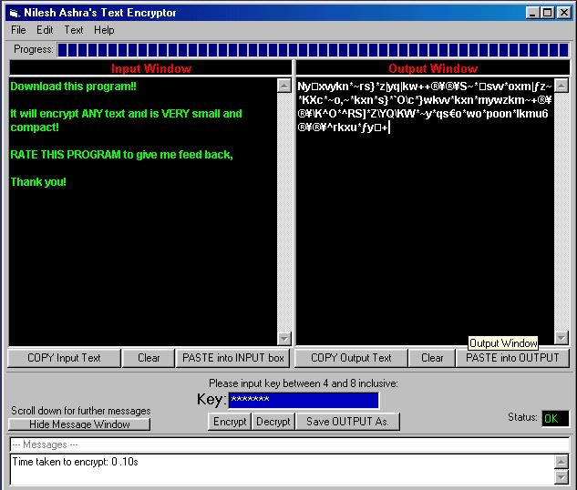



## Encryption Program for TEXT, HTML or any text format file/input\!

### Description

Using a user-defined KEY, my software will totally securely encrypt the text, with it as impossible as it gets to crack. Options to import text, open files, and save encrypted code as ANY format. DOWNLOAD THIS!
 
### More Info
 
A Key, the Text.

Umm, nope.

A load of encrypted junk! Impossible to crack!

             |
---                |---
**Submitted On**   |2001-06-13 17:49:08
**By**             |[Nilesh Ashra](https://github.com/Planet-Source-Code/PSCIndex/blob/master/ByAuthor/nilesh-ashra.md)
**Level**          |Beginner
**User Rating**    |4.0 (8 globes from 2 users)
**Compatibility**  |VB 5\.0, VB 6\.0
**Category**       |[Encryption](https://github.com/Planet-Source-Code/PSCIndex/blob/master/ByCategory/encryption__1-48.md)
**World**          |[Visual Basic](https://github.com/Planet-Source-Code/PSCIndex/blob/master/ByWorld/visual-basic.md)
**Archive File**   |[Encryption211096132001\_\.zip](https://github.com/Planet-Source-Code/nilesh-ashra-encryption-program-for-text-html-or-any-text-format-file-input__1-24057/archive/master.zip)

